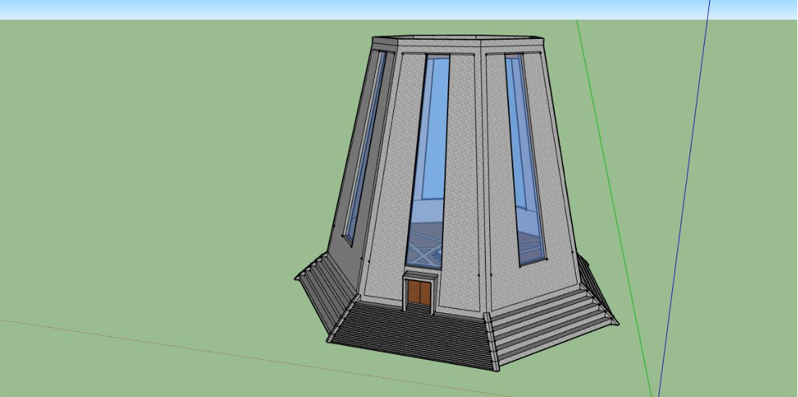
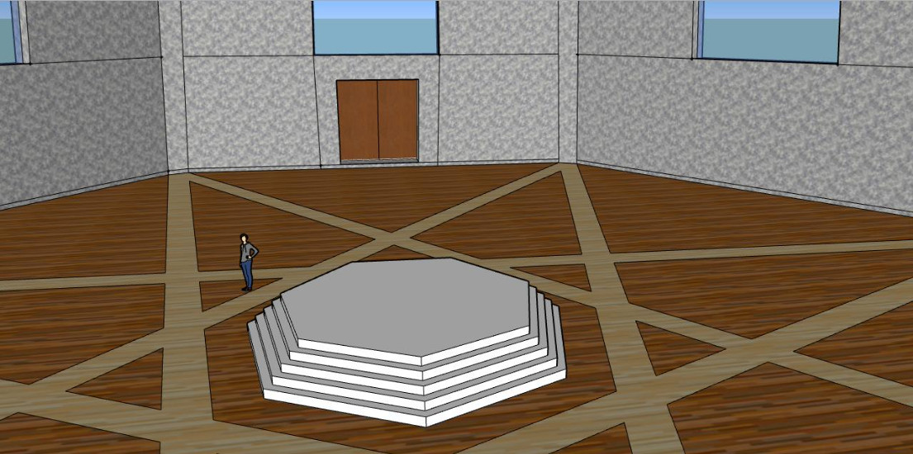
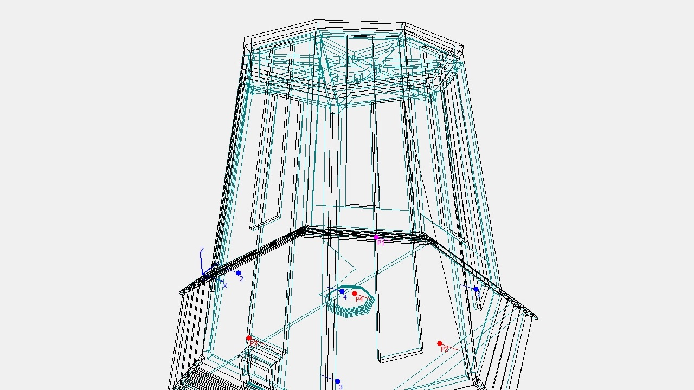
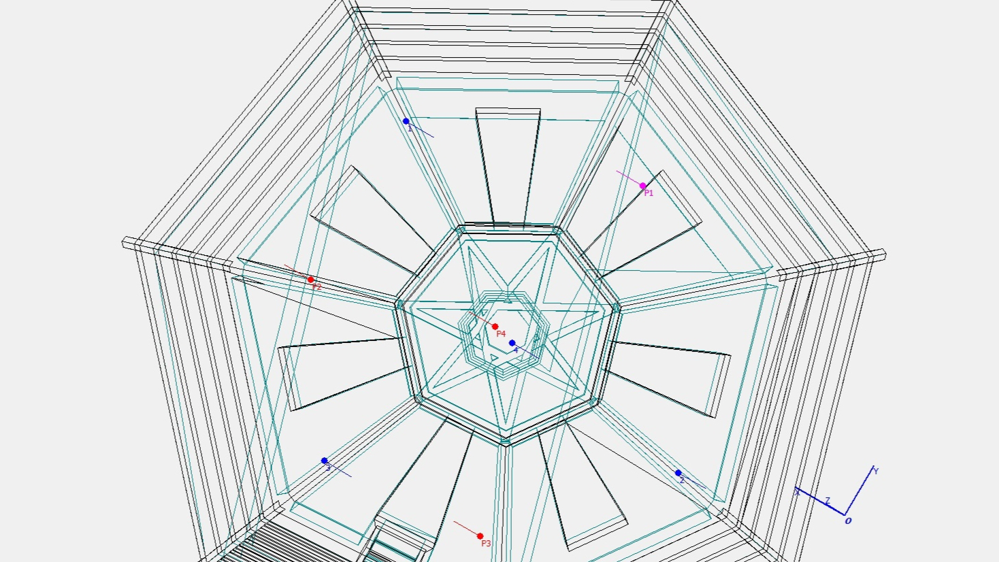

# odeon-auralisation

Simulated impulse response measurements of a CAD model (made in SketchUp) in [Odeon](https://odeon.dk/).

This is from my masters, years ago. It's been gathering dust for a while, so I figured I may as well upload it, even if the IRs are a bit too reverberant (see data), to say the least.

Exterior:                      | Interior:
:-----------------------------:|:-----------------------------:
       |  

Source and receiver positions: | Source and receiver positions:
:-----------------------------:|:-----------------------------:
   | 
